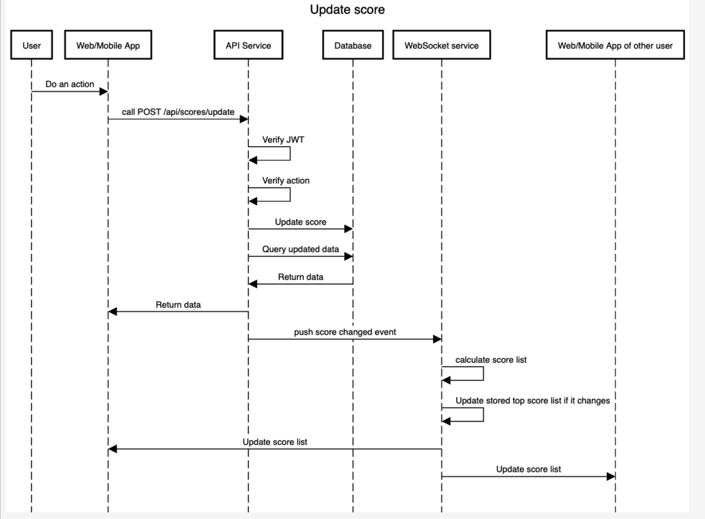
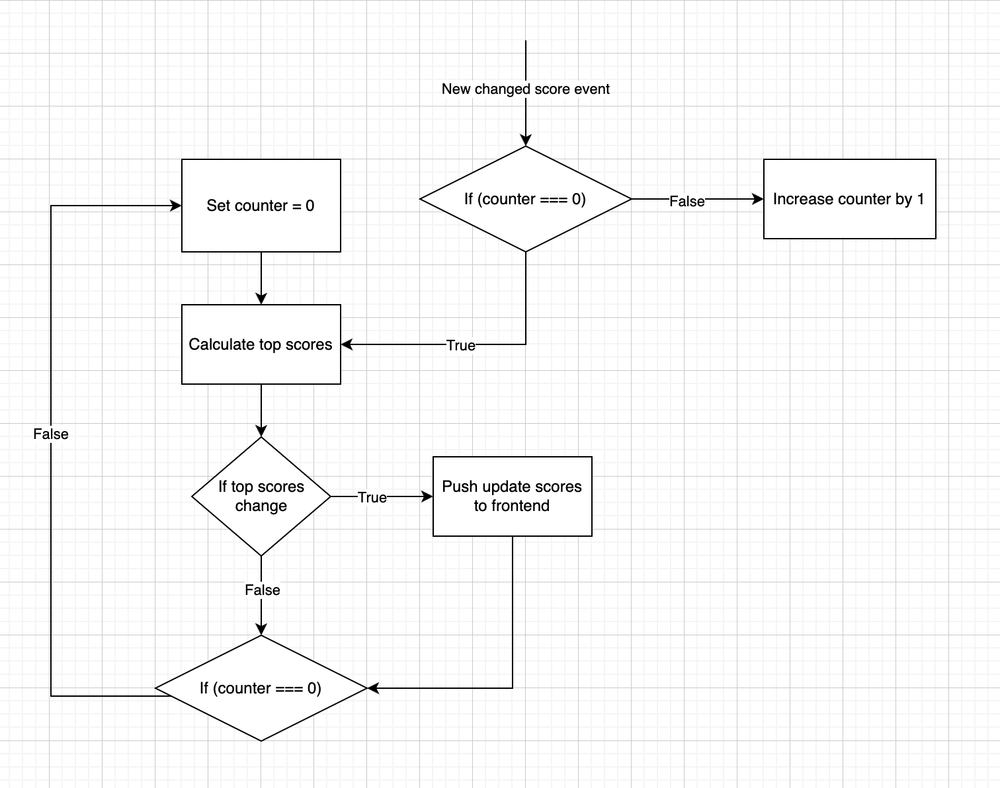

# Score Board API Module Specification

## Overview
This document outlines the specifications for a Score Board API module that provides real-time updates to a website's score board. The module handles score updates, authentication, and live updates to display the top 10 users' scores.

## Table of Contents
1. [Architecture](#architecture)
2. [Flow Diagram](#flow-diagram)
3. [Improvement](#improvement)
4. [Task Breakdown](#task-breakdown)
5. [API Endpoints](#api-endpoints)
6. [Authentication & Authorization](#authentication--authorization)
7. [Real-time Updates](#real-time-updates)
8. [Data Model](#data-model)
9. [Security Considerations](#security-considerations)
10. [Implementation Notes](#implementation-notes)


## Architecture
The Score Board API module is part of the backend application server and interacts with:
- Client applications (web/mobile)
- Database for persistent storage
- WebSocket service for real-time updates

Assume we already have a system with users and actions, where users can see the top 10 scores on the leaderboard. In this case, we will only outline the tasks needed for live score updates.

Also, assume the system already has an authorization method in place, such as using JWT.

**The main idea is to use WebSockets for real-time score updates. Whenever a user performs an action, the frontend app will call an API endpoint to update the score. Once the score update is successful, the API server will trigger an event in the WebSocket service to notify it to recalculate the top scores. After recalculating, the service will check if the leaderboard has changed, and if so, the WebSocket will send the updated result to all online users in the frontend app.**

## Flow Diagram



## Improvement 

One improvement we can make is to optimize score recalculation when many users update their scores simultaneously. Instead of recalculating the top scores for each individual update, the server should only recalculate once, as only the final top scores matter. For instance, if the WebSocket service is already calculating the top scores and 30 new score update events are pushed to the service, it will only need to recalculate the top scores once after completing the current calculation, accounting for all 30 events. To achieve this, we can introduce a counter to track the number of pending score changes. When the service checks the counter, it will reset it to zero and initiate the recalculation process.



## Task breakdown

| Task Description | Notes |
|-----------------|-------|
| Implement endpoint to get top score | Defined below in [API Endpoints](#api-endpoints) |
| Implement endpoint to get user score | Defined below in [API Endpoints](#api-endpoints) |
| Implement endpoint to update user's score | Defined below in [API Endpoints](#api-endpoints) |
| Implement the WebSocket connection | Init the WebSocket service and set up connection handling |
| Implement the WebSocket function to push score list to subscribers | Create function to broadcast updated scores to connected users |
| Implement the WebSocket service to be called when a score is updated | More detail on the diagram in [Improvement](#improvement) and in [Real-time Updates](#real-time-updates) |

## API Endpoints

### 1. Update User Score
```
POST /api/scores/update
```

**Request Headers:**
- `Authorization: Bearer {jwt_token}`

**Request Body:**
```json
{
  "actionId": "string",  // Unique identifier for the completed action
  "actionData": {        // Optional metadata about the action
    "key1": "value1",
    "key2": "value2"
  }
}
```

**Response (200 OK):**
```json
{
  "success": true,
  "newScore": 125,
  "rank": 5
}
```

**Error Responses:**
- 401 Unauthorized: Invalid or missing authentication token
- 403 Forbidden: User not authorized to perform this action
- 429 Too Many Requests: Rate limit exceeded
- 400 Bad Request: Invalid action ID or data

### 2. Get Top Scores
```
GET /api/scores/top
```

**Query Parameters:**
- `limit`: Number of top scores to return (default: 10, max: 100)

**Response (200 OK):**
```json
{
  "scores": [
    {
      "userId": "user123",
      "username": "PlayerOne",
      "score": 1250,
      "rank": 1,
      "avatar": "https://example.com/avatars/user123.jpg"
    },
    // ... more users
  ],
  "lastUpdated": "2025-03-09T19:30:45Z"
}
```

### 3. Get User Score
```
GET /api/scores/user/{userId}
```

**Request Headers:**
- `Authorization: Bearer {jwt_token}`

**Response (200 OK):**
```json
{
  "userId": "user123",
  "username": "PlayerOne",
  "score": 1250,
  "rank": 5,
  "avatar": "https://example.com/avatars/user123.jpg"
}
```

## Authentication & Authorization

1. **JWT Authentication**: All score update requests must include a valid JWT token in the Authorization header.

2. **Action Verification**: 
   - Each action that increases a score must have a unique ID
   - The server must verify that:
     - The action is valid and allowed
     - The action hasn't been previously counted
     - The user is authorized to perform this action

3. **Rate Limiting**:
   - Implement rate limiting to prevent abuse
   - Suggested limits: 50 requests per minute per user

## Real-time Updates

1. **WebSocket Connection**:
   ```
   WS /api/scores/live
   ```

2. **Events**:
   - `topScoresUpdate`: Sent when the top 10 scores list changes

3. **WebSocket Message Format**:
   ```json
   {
     "event": "topScoresUpdate",
     "data": {
       "scores": [
         // Array of user scores as in GET /api/scores/top
       ]
     }
   }
   ```

## Data Model

### Score Entity
```
{
  userId: string (required) - Unique identifier for the user
  username: string (required) - Display name
  score: integer (required) - Current total score
  lastUpdated: timestamp (required) - When the score was last updated
  avatar: string (optional) - URL to user's avatar image
  actionHistory: array (required) - List of recorded actions
}
```

### Action History Entry
```
{
  actionId: string (required) - Unique identifier for the action
  timestamp: timestamp (required) - When the action occurred
  scoreChange: integer (required) - Points added for this action
  metadata: object (optional) - Additional action data
}
```

## Security Considerations

1. **Prevent Score Manipulation**:
   - Validate all action IDs on the server
   - Store a history of processed actions to prevent replay attacks

2. **Rate Limiting and Abuse Prevention**:
   - Implement IP-based and user-based rate limiting
   - Monitor for suspicious activity patterns
   - Add CAPTCHA for suspicious activities

3. **Data Validation**:
   - Validate all input data
   - Sanitize data before storage and display

## Implementation Notes

1. **Caching Strategy**:
   - Cache the top scores in memory or using Redis
   - Implement a cache invalidation strategy when scores change
   - Consider using a leaderboard-specific data structure (e.g., sorted sets in Redis)

2. **Performance Considerations**:
   - Index the database for fast score retrieval
   - Use database transactions for score updates
   - Optimize WebSocket connections for high concurrency
